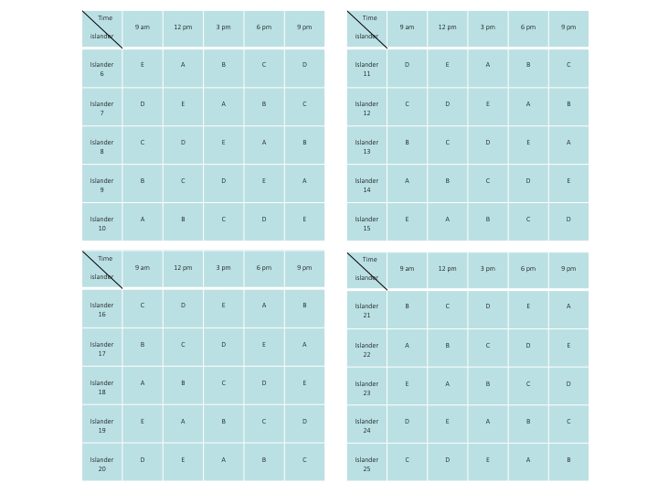
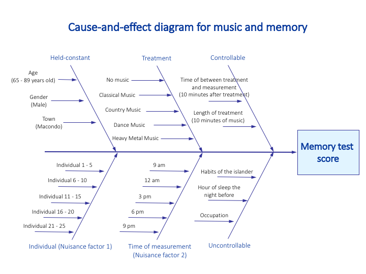

\tableofcontents
\newpage

# Abstract

We have all heard about the saying that music can help improve one's memory. Based on the fact that we have access to different types of musical treatments and memory tests, the goal of this research project is to find whether there is an effect of music on islander's memorization ability, and which type of music has the most significant improvement on human's memorization capability. The research is conducted using the open platform `The Island`[^1].

# Introduction
  
According to an annual report produced by the Administration for Community Living, about one in every seven Americans is over the age of 65 in 2017, and the proportion will swell to one in five by 2040. Old age is accompanied by declines in mental domains such as processing speed, reasoning, memory and executive functions (Ian J. Deary, 2009). As America along with the rest of the world enters an aging society, there is a growing interest in identifying factors that can alleviate age-associated cognitive decline.    


It has been suggested by some researches (Cirigliano, 2013; Michael, David, Gerald, & Volker, 2014)  that the temporal pattern structure in music can enhance cognition and memory retention. This effect appears to be especially significant for people with cognitive deterioration/impairment. Such theory has been put to practice by organizations such as MUSIC AND MEMORY, a non-profit that brings personalized music playlists to elders in nursing homes. They claim that “ Music is the most ‘fast-acting’non-drug approach to improving the lives of all persons with dementia, Parkinson’s, depression and other behavioural challenges” (2017 Impact Report, pg 1).   

      
Another interest of substantive researchers is the effect of different genre of music on memory and cognition. There is a considerable amount of publication dedicated to investigating the effect of Classical music on performance and memory retention. Rausher, Shaw and Ky (1993) found that listening to classical music improved intelligence and memory (the "Mozart Effect") and a British radio station specialised in western classical music was shown to help listeners relax and improve brain efficiency (Blanchard, 1979). Other studies compared different genres of music and concluded fast-paced music such as Rap and Heavy Metal may distract cognitive effects and lead to poorer performance (Dibben & Williamson, 2007; Smith & Morris, 1977).    

  
Due to music’s accessibility as well as its universal presence, our study is interested in testing whether there is theoretical support for the uses of music as a means for memory improvement. We propose that listening to music will lead to a statistically significant increase in the memory test score. For this study, we apply four genres of music (Country, Classical, Dance, Heavy Metal) as treatment variables and a control variable (No Music).    
  
  
In this experiment, our goal is to:    

(1) test if music is a valid treatment for increasing memory performance;
(2) find the best genre of music that leads to said improvement. 

# Experiment

## Participants

We chose the virtual participants from the online resource the Island. We found that female who age 65 or older are most susceptible to cognitive impairment and are outperformed by men (in the same age group) in fields of visuospatial, verbal processing, semantic and episodic memory (Laws, K. R. 2016). Because memory retention differs in individual (M. Karl Healey 2014), and in time of the day (A. D. Baddeley, 2007), we use Latin Square to block by individual subject and time of the day. In order to increase power as well as our error degrees of freedom, we repeated this 5*5 Latin Square five times. This resulted in our necessary sample size of 25 participants. Moreover, studies have shown that cognitive impairment and dementia are are predicted to increase proportionately more in developing regions, thus indicating a potential association between the region of residence and cognitive performance (WHO, 2013). We decide to hold this factor constant and choose participants from the Town Macondo, where the population of senior citizens is the largest. In order to obtain the 25 participants, we went to the 64 neighbourhoods of Macondo and request consent from female participants age 65 to 89. 

## Design

The design that we have chosen to use in this project is 5 x 5 Latin Square with five replicates. 

**Model**:

$$y_{ijk} = \mu + \alpha_{i} + \beta_{j} + \gamma_{k} + \epsilon_{ijk},\ where\  i, j, k = 1, 2, 3, 4, 5$$

<center>

{width=80%}

{width=98%}

</center>

- **Held-constant variables**: 
    + gender: male 
    + region: town Macondo
    + age: seniors (age between 65 and 89)
- **Nuisance factors**:
    + individuals: five individuals in each Latin Square
    + time of treatment: 9 am, 12 pm, 3 pm, 6 pm, and 9 pm
- **Treatment**:
    + type of music: no music (A), Classical Music (B), Country Music (C), Dance Music (D), or Heavy Metal Music (E)
- **Replicates**:
    + sample size determination: 5 replicates of a 5 x 5 Latin Square (i.e., 25 individuals in total)
    
<center>



</center>    

- **Random assignment method**:
    (1) We assign a number from 1 to 25 to the 25 participants, then generate a random sequence (A) of number from 1 to 25 using R (`set.seed(10000)`). Then we generate a random sequence (B) of 1 to 5 (`set.seed(10000)`). We assign the participants indexed with the first five number of sequence A to the Latin Square replicate indexed with the first number in sequence B; the next five in A to the second number in B so on and so forth. 
    (2) We then randomly permute the columns, randomly permute the rows, and then assign the treatments to the Latin letters in a random fashion. We ensure each treatment occur once in each row and each column. 

## Instruments

For this experiment, we use simulated islanders on [`The Island`](http://island.maths.uq.edu.au/index.php)[^2]. We will use the different genre of music under “Music” task to assign treatment at designated time, and record performance of "Memory Test Card". Realistically, measurement errors are introduced in the study as the time of measurement cannot be exact (e.g., 9 am sharp). However, we are allowing small measuring errors since it would not have significant impact on our final result. 

## Procedure

(1) For each Latin Square experiment, we first measure the performance of “Memory Test Card”, then wait for 5 minutes.
(2) Then we assign treatment according to the below diagram; after the music treatment finishes, we wait 10 minutes then perform a second “Memory Test Card” and record the result. 
(3) We replicate the above procedure for all 5 Latin Squares. 

# Data Analysis

## Data Structure

```{r, echo = F, results = 'asis', message = F}
library(pander)
table <- read.csv("ProjectData.csv")
data <- table[, 1:9]
data$ID <- as.factor(data$ID)
table <- data[, 1:6]

knitr::kable(head(table, 10), caption = "Structure of data collected")
```

## Statistics of sample

**Age distribution: **

Firstly, we took a look at the age distribution of 25 senior male islanders that we sampled during the experiment:

```{r, echo = F, fig.cap = "Age distribution of sample", fig.dim = c(4,4)}
hist(data$age[!is.na(data$age)], main = "age distribution of 25 islanders", col = "cyan", xlab = "age")
```

**Music preference:**

After conducting the experiment on the Island, we also sent out a post-experiment survey to the selected 25 islanders. The purpose of this survey is to see which type of music is the islander's favorite, among all four types of music (classical, country, dance and heavy metal music).

The result of the survey is as following:

```{r, echo = F, fig.cap = "barplot for results of survey", fig.dim = c(4,4)}
barplot(table(data$Favorite.Music[data$Favorite.Music != "", drop = T]), main = "favorite music of 25 islanders", col = "cyan", xlab = "music type", names = c("classical music", "country music", "dance music"))
```

Observation:

- Age distribution: most of the senior male islanders have the age between 65 to 80 years old.
- Favorite music type: most of the islanders sampled prefer listening to classical music, while a small portion of the islanders prefer country and dance music. One important observation is that none of the 25 islanders we sampled prefer listening to heavy metal music, which may be closely connected with results.


## Exploratory Data Analysis (EDA)

In this section, we did exploratory data analysis by looking at the boxplots for each Latin Square and the boxplot for all five Latin Squares combined.

**Boxplot for each individual Latin Square:**

```{r, echo  = F}
# Boxplot for each square:
table1 <- table[1:25, ]
table2 <- table[26:50, ]
table3 <- table[51:75, ]
table4 <- table[76:100, ]
table5 <- table[101:125, ]
par(mfrow = c(2,2))
boxplot(difference ~ treatment, data = table1, main = "Latin Square 1", col = as.integer(table1$treatment) + 1, xlab = "treatment", ylab = "difference")
boxplot(difference ~ treatment, data = table2, main = "Latin Square 2", col = as.integer(table2$treatment) + 1, xlab = "treatment", ylab = "difference")
```

```{r, echo = F}
par(mfrow = c(2,2))
boxplot(difference ~ treatment, data = table3, main = "Latin Square 3", col = as.integer(table3$treatment) + 1, xlab = "treatment", ylab = "difference")
boxplot(difference ~ treatment, data = table4, main = "Latin Square 4", col = as.integer(table4$treatment) + 1, xlab = "treatment", ylab = "difference")
```

```{r, echo = F, fig.cap = "Boxplots for individual Latin Squares"}
par(mfrow = c(2,2))
boxplot(difference ~ treatment, data = table5, main = "Latin Square 5", col = as.integer(table5$treatment) + 1, xlab = "treatment", ylab = "difference")
```

**Boxplot for all five Latin Squares combined:**


```{r, echo = F, fig.cap = "Boxplot for all five Latin Squares"}
# Boxplot for all Latin Squares:
par(mfrow = c(1,1))
boxplot(difference ~ treatment, data = table, main = "All Latin Squares", col = as.integer(table$treatment) + 1, xlab = "treatment", ylab = "difference")
```

## Paired t-test

We conducted a paired t-test between the memory test score before and after the treatment. 

```{r, echo = F, results = 'asis'}
# paired t-test:
before <- table$before; after <- table$after
pander(t.test(before, after, paired = T))
#t.test(before, after, paired = T)
```

Based on this result, our observation is that the difference between before and after the treatment is very small, which indicates that the overall result may not be very significant.

## Analysis of Variance (ANOVA)

We will conduct an ANOVA test on the results collected. We will first load the data into R and use `aov()` function to analyze if there is any difference among the effects of different genre of music on memory retention in male aged 65 to 79, among all five 5 x 5 Latin Squares in data collected. 

In this process, we will use paired t-test to determine if there is any significant difference among the different groups of genres of music and disregard the interactions between nuisance variables. That is to say, we will obtain the degrees of freedom, sum of squares and mean sum of squares for row and column blocks, the treatment, and their `F-value` and `p-value` in the summary statistics. 


We divided our analysis of variance (ANOVA) into two sections: 

- in the first part, we looked at the ANOVA table for each individual Latin Square;
- in the second part, we investigated the ANOVA table for all five Latin Squares combined.

**Part 1: ANOVA of five individual Latin Squares:**

```{r, echo = F, message = F}
# ANOVA for before ~ ID + time
anova_before <- aov(before ~ ID + time, data = table)
#summary(anova_before)

# ANOVA for all five Latin Squares
anova <- aov(difference ~ treatment + ID + time, data = table)
# pander(summary(anova))

# ANOVA for individual Latin Square:
anova1 <- aov(difference ~ treatment + ID + time, data = table1)
#pander(summary(anova1))
anova2 <- aov(difference ~ treatment + ID + time, data = table2)
#pander(summary(anova2))
anova3 <- aov(difference ~ treatment + ID + time, data = table3)
#pander(summary(anova3))
anova4 <- aov(difference ~ treatment + ID + time, data = table4)
#pander(summary(anova4))
anova5 <- aov(difference ~ treatment + ID + time, data = table5)
#pander(summary(anova5))
```

**Latin Square 1:**

`r pander(summary(anova1), caption = "Analysis of Variance Table for Latin Square 1")`

**Latin Square 2:**

`r pander(summary(anova2), caption = "Analysis of Variance Table for Latin Square 2")`

**Latin Square 3:**

`r pander(summary(anova3), caption = "Analysis of Variance Table for Latin Square 3")`

**Latin Square 4:**

`r pander(summary(anova4), caption = "Analysis of Variance Table for Latin Square 4")`

**Latin Square 5:**

`r pander(summary(anova5), caption = "Analysis of Variance Table for Latin Square 5")`

**Part II: ANOVA for all five Latin Squares**:

**All five Latin Squares:**

`r pander(summary(anova), caption = "Analysis of Variance Table for five Latin Squares")`

Based on the ANOVA table obtained above, we observe that:

- Among all five individual Latin Squares, music treatment in Latin Square 1 and Latin Square 5 have significant effects on improving memory test score.
- However, music treatment is not significant when we combine all five Latin Squares together.

To explore more about which music treatment is more helpful for improving memory test score on islanders, we conducted multiple groups comparision tests on Latin Square 1 and Latin Square 5.

## Multiple groups comparison

From the last section, we observe that music treatment is indeed significant in Latin Square 1 and 5. To see which music plays a more important role in improving the memory test score, we did multiple groups comparison on each of the two squares, using `Tukey HSD` method.

**Multiple groups comparison for Latin Square 1:**

```{r, echo = F, fig.cap = "Multiple groups comparison on Latin Square 1 and 5"}
par(mfrow = c(2,2))
plot(TukeyHSD(anova1, "treatment"))
title(sub = "Latin Square 1", cex = 0.8)
plot(TukeyHSD(anova5, "treatment"))
title(sub = "Latin Square 5", cex = 0.8)
```

**Multiple groups comparison for Latin Square 5:**

Based on the multiple groups comparison, we observe that:

- In Latin Square 1:
- In Latin Square 2:

## Model assumption checking

**Model**:

$$y_{ijk} = \mu + \alpha_{i} + \beta_{j} + \gamma_{k} + \epsilon_{ijk},\ where\  i, j, k = 1, 2, 3, 4, 5$$

**Assumption checking:**

```{r, echo = F, message = F, fig.cap = "Diagnostics plots for model difference ~ treatment + ID + time"}
par(mfrow = c(2,2))
plot(anova)
```

- Based on the residuals vs. fitted values plot, we observe that there is no certain pattern in the graph, and the average value of error terms is mostly around zero. This indicates that the assumption of independent error terms with average value of zero is satisfied.
- Based on the normal QQ-plot, we observe that most of the data points are around the 45-degree line through the origin. This indicates that the assumption of normally distributed error terms is mostly satisfied.
- Based on the $\sqrt{standardized\ residuals}$ vs. fitted values plot, we observe that there is a slightly decreasing trend in the value of $\sqrt{standardized\ residuals}$. This indicates that the assumption of constant variance of error terms is slightly violated.

# Conclusion

To be finished.

# Discussion

- Since we choose to sample senior islanders in the experiment, we consider sampling senior female islanders in the future to have further investigation on whether music has effects on memory.
- Based on the post-experiment survey, we discovered that most of the senior islanders prefer listening to classical and country music. This provides motivation for further studies on the relation between favorite type of music, music treatment, and memory test score.

# References

## Journal References

- [`Music And The Brain`](https://www.scientificamerican.com/article/music-and-the-brain-2006-09/), Norman M. Weinberger. *Scientific American*, September 1, 2006.
- [`Music Moves Brain to Pay Attention`](https://med.stanford.edu/news/all-news/2007/07/music-moves-brain-to-pay-attention-stanford-study-finds.html), Mitzi Baker. *Stanford Medicine News Center*, August 1, 2007.
- [`This is Your Brain on Music`](https://www.cnn.com/2013/04/15/health/brain-music-research/index.html), Elizabeth Landau. *CNN*, January 23, 2018.
- [`Music and health`](https://www.health.harvard.edu/staying-healthy/music-and-health), *Harvard Medical School*, July 2011.
- [`Individual Differences in Learning and Memory`](https://www.encyclopedia.com/psychology/encyclopedias-almanacs-transcripts-and-maps/individual-differences-learning-and-memory). *Encyclopedia*, 2014.

## Publication References

- [`A neuropsychological investigation of music, emotion, and autobiographical memory`](https://search.proquest.com/docview/1701283142?pq-origsite=summon&accountid=14512), Belfi, Amy Meredith. *University of Iowa*, 2015. 
- [`Music in the brain: Differences between musicians and non-musicians`](https://search.proquest.com/docview/304910597?pq-origsite=summon&accountid=14512), Orlando, Julie. *University of Northern British Columbia (Canada)*, 2006. 
- [`Music for the Mind: A Study Into Musical Preferences, Personality Traits and Memory Retention`](https://search.proquest.com/docview/2083960675?accountid=14512), Rogers, Rhiannon. *Western Sydney University (Australia)*, 2018. 
- [`Music and cognitive abilities: A look at the Mozart Effect`](https://search.proquest.com/docview/305228684?pq-origsite=summon&accountid=14512), Bressler, Randy A. *The Chicago School of Professional Psychology*, 2003. 
- [`Music and the Brain`](https://www.sciencedirect.com/science/article/pii/S1878875010001129), Edward R. Laws, Jr. *Harvard University*, 2010. 
- [`The effect of music genre on a memory task`](https://scholar.utc.edu/cgi/viewcontent.cgi?article=1214&context=mps), Bugter, Darragh & Carden, Randy. *Trevecca Nazarene University*, 2012.
- [`Individual Differences in Memory Search and Their Relation to Intelligence`](http://memory.psych.upenn.edu/files/pubs/HealEtal14.pdf), M. Karl Healey. *University of Pennsylvania*, 2014.
- [`Memory and time of day`](https://journals.sagepub.com/doi/10.1080/14640747008401939), A. D. Baddeley, J. E. Hatter, Denise Scott & Aileen Snashall. *Quarterly Journal of Experimental Psychology*, 1970.
- [`The effect of music genre on a memory task`](https://scholar.utc.edu/mps/vol17/iss2/14), Bugter, Darragh and Carden, Randy.*Modern Psychological Studies, Vol. 17, No.2, Article 14*, 2012. 
- [`Music mnemonics aid Verbal Memory and Induce Learning – Related Brain Plasticity in Multiple Sclerosis`](https://www.frontiersin.org/articles/10.3389/fnhum.2014.00395/full), Thaut, Michael & Peterson, David & C McIntosh, Gerald & Hömberg, Volker. *Frontiers in human neuroscience*, 2014.
- [`Key Components of the Mozart Effect`](https://journals.sagepub.com/doi/10.2466/pms.1998.86.3.835), Frances H. Rauscher & Gordon L. Shaw. *University of Wiscomin, Osbkosb* & *University of California, Irvine*, 1998.


[^1]: [`The Island: http://island.maths.uq.edu.au`](http://island.maths.uq.edu.au)
[^2]: [`The Island: http://island.maths.uq.edu.au`](http://island.maths.uq.edu.au)
